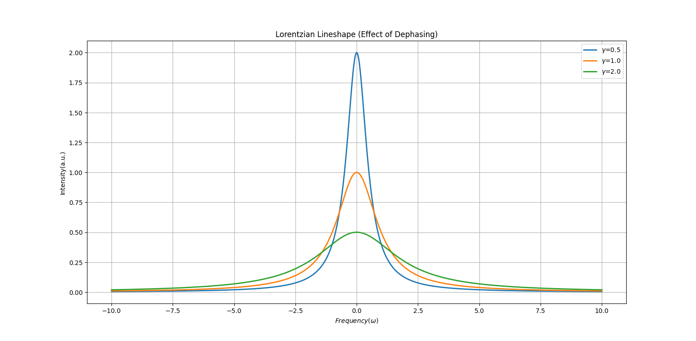

# spectral-line-simulator
Simulation of spectral linewidth &amp; dephasing using Lorentzian profile

## Physics Background
In spectroscopy, the linewidth is related to the dephasing time (T2). Faster dephasing leads to broader spectral lines.

The Lorentzian lineshape is given by:
$I(\omega)\propto\frac{\gamma}{(\omega - \omega_0)^2 + \gamma^2}$

## Features
- Simulates Lorentzian spectral line
- Demonstartes effect of dephasing
- Visualizes multiple linewidths

## Output

## Author
Arijit Mallick
